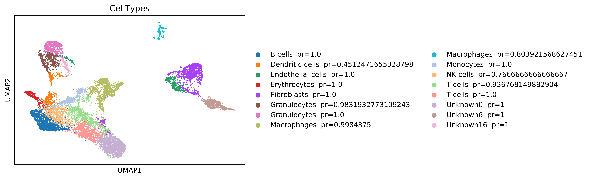
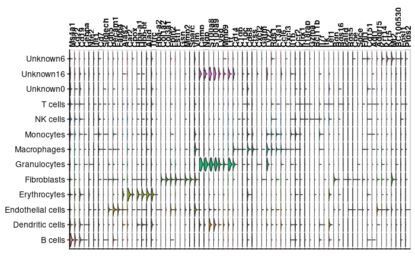
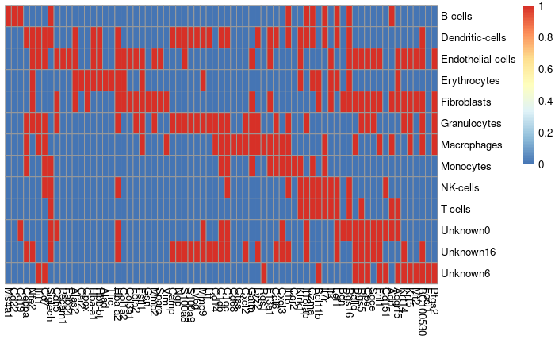

## scRNA-seq analysis for construction of MCDMs, MO-MCDMs, and Connective Pathway Analysis

### Define data structure and input files

``` r
dir.create("../data/IPA/curation", recursive = T)
dir.create("'../data/references/'")
dir.create("../data/sorted_DGEs")
dir.create("../data/NicheNet_analysis")
dir.create("../data/NicheNet_analysis_curated")
dir.create("../data/clustering_and_celltype_identification")
dir.create("../data/scVI_normalized")
dir.create("../data/UR_ranking_by_target_effect")
```

The expected data input is a csv.gz matrix, with cells over columns and
genes over rows. The data from this study can be downloaded from ‘add
GEO-link’, and we recommend saving them to the ‘data’ folder.

``` r
### Read data from GSE and save it to data/ 
input_file = "../data/UMI_expression_matrix.txt.gz"
```

### Quality assessment and sorting

To ensure good quality data for downstream analyses, it is recommended
to remove poor quality cells and genes from the analyses. We performed
these analyses on the input_file, for all the organs combined. We define
and keep the good quality cells as those having a minimum of 400
transcripts, 200 genes, and less than 20% mitochondrial genes. The good
quality genes kept were defined as those being identified in at least 1%
of the cells.

Due to the risk of duplicates in the library resulting in two or more
cells sharing a cell barcode, it is also recommend to remove outliers.
Based on empirical evaluation of the distribution an overestimation of
transcripts count over the cells, we removed all cells with \>6000
transcripts.

The output file is saved in data/sorted_DEGs.

``` r
source('../R/sc_data_quality_sorting.R')
sc_data_quality_sorting(input_file)
```

### Clustering and cell type identification by Leiden’s algorithm

The cell types were then identified by clustering them together with a
bulk reference data-set of known cell types using the Leiden’s
algorithm. This script has in-built denoising using the DCA
autoencoder[1] and thus takes the UMI-count data, as output by the
[Quality assessment and sorting -
script](#quality-assessment-and-sorting), as input.

For this script to work properly, the cells in the input file need to be
named according to the following format;
‘\[tissue/organ\]\_\[project\]\_\[disease group\]\[group
number\]\_\[cellID\]’, where ‘tissue/organ’, ‘disease group’, and
‘disease group’ + ‘group number’ will be used for coloring of the
clusters and/or cell classification information for the output file.
\[disease group\] should be written as “H” = Healthy or “S” = Sick.
Example: “Lung_CIA_H6_GTTAAGCATTAT”.

As reference for cell type identification, we used the mouse bulk
expression data of sorted cell populations available in the R package
SingleR (v1.0.6)[2]. To extract the reference for cell typing, we ran
the following R script.

``` r
source('../R/SingleR_reference_retrieval.R')
out_file <- '../data/references/ReferenceDataMouse.csv'
SingleR_reference_retrieval(out_file)
```

To perform clustering and cell type identification, we ran the
celltyping.py script as follows, where the first two arguments refers to
the single cell and bulk input data respectively and the third argument
is the resolution parameter.

``` bash
python Python/celltyping.py ../data/sorted_DGEs/sorted_expression_matrix.csv data/references/ReferenceDataMouse.csv 1.0
```

The output from this script consists of umap plots where the cells are
colored based on cell type identity (Figure 1), mouse ID, and organ, and
a ‘cluster_ids.csv’-file containing the clustering and cell type
information (Table 1), saved to
‘data/clustering_and_celltype_identification’.

<figure>
<figcaption aria-hidden="true">Figure 1. UMAP with cells colored based on cell type identification.</figcaption>
</figure>

|                          | CellType    | disease_group | tissue |
|:-------------------------|:------------|:--------------|:-------|
| Lung_CIA_H6_GTTAAGCATTAT | Macrophages | Healthy       | Lung   |
| Lung_CIA_H6_CTGGGCAAACAT | Macrophages | Healthy       | Lung   |
| Lung_CIA_H6_TTCGTAGCGCGG | Macrophages | Healthy       | Lung   |
| Lung_CIA_H6_AGAGGGCGTCCT | Macrophages | Healthy       | Lung   |
| Lung_CIA_H6_ACGCCAGAAAGG | Macrophages | Healthy       | Lung   |

Table 1. Example output from cell type identification.

### Data normalization and Differential expression analysis

For each cell type in each organ, we calculate the DEGs between sick and
healthy mice using scVI-tools (version 0.7.1)[3]. The data was trained
and normalized, including batch effect removal based on the individual
samples sequenced (i.e. between organs and mice IDs). DEGs were then
calculated between the two groups including the parameter mode=‘change’.

Note that the training will produce somewhat different output from each
run, so in case the analyses need to be reproduced, the trained data is
saved to ‘outdir’, ‘/full_posterior_400/model_params’. If this directory
exists, the trained data will be loaded from there. As the training can
be time consuming, this also saves computational time. Note also that
the training results will depend on the previous set-ups, and if any of
the parameters ‘n_epochs’, ‘use_batches’, or ‘batch_id’ are changed, the
training need to be re-run.

\*\* Not provided yet, too big?\*\* To reproduce our results, use the
trained data provided in
‘data/scVI_normalized/full_posterior_400/model_params’.

``` bash
# define in-/output directories and files
infile=../data/sorted_DGEs/sorted_expression_matrix.csv
outdir=../data/scVI_normalized/
clust_file=../data/clustering_and_celltype_identification/cluster_ids.csv
outdir_DEG=../data/DEG_analysis/sick_vs_healthy
mkdir -p $outdir_DEG
mkdir -p $outdir_DEG/change_mode

# Calculate DEGs for each cell type and organ, between sick and healthy mice
python Python/scVI_v0.7.1.py --infile $infile --outdir $outdir --n_epochs 400 --DEG_analysis --clust_file $clust_file --outdir_DEG $outdir_DEG --sort_column 1 3 --group_column 2 --use_batches --batch_id 0 2
wait

# to see all potential parameters for data normalization and differential expression analysis, run 'python ../Python/scVI_v0.7.1.py --help'
```

The output from this code consists of one table of DEGs for each cell
type and organ as defined by ‘sort_column’, saved in ‘outdir_DEGs’.
These files contains values which describes the data; scale values from
the training, log fold-change values, non-zero proportions, and raw
normalized mean values, for group 1 and group 2 respectively. The
group-ids can be interpreted based on the output file names,
group1_vs_group2 (eg. sick_vs_healthy). We define the significant DEGs
based on the column ‘is_de_fdr_0.05’=True.

Additionally, the normalized and latent data is saved to ‘outdir’ for
downstream analyses.

We further subset these tables only to include significant DEGs, and
columns relevant for downstream analyses. The output from this analysis
consists of one table of significant DEGs for each input table of DEGs,
which are saved to ‘\[outdir_DEG\]/subset_significant’ (Table 2).
Additionally, one matrix listing all DEGs is created and saved as
‘\[outdir_DEG\]/subset_significant/DEGs_Sick_vs_Healthy.csv’, which will
be later needed for analysis of [cell-cell
interactions](#identification-of-cellular-interactions-and-mcdmmo-mcdm-construction).

``` r
source('../R/DEG_sort_significant.R')
outdir_DEG <- '../data/DEG_analysis/sick_vs_healthy/change_mode'
DEG_files <- list.files(outdir_DEG, full.names = TRUE, pattern = 'DEGs_')
# subset the DEGs
DEG_sort_significant(DEG_files, outdir_DEG)
```

|          | proba_de | proba_not_de | bayes_factor |  lfc_mean | is_de_fdr_0.05 |
|:---------|---------:|-------------:|-------------:|----------:|:---------------|
| Ppp2r5d  |   0.9958 |       0.0042 |     5.468459 |  6.584303 | True           |
| Ifi27    |   0.9918 |       0.0082 |     4.795386 |  3.217298 | True           |
| Snx20    |   0.9908 |       0.0092 |     4.679308 |  4.120939 | True           |
| Slc25a20 |   0.9898 |       0.0102 |     4.575114 | -4.061067 | True           |
| Bag6     |   0.9874 |       0.0126 |     4.361378 |  3.659021 | True           |

Table 2. Example output from differential expression analysis.

### Cell type identification using marker genes

As the reference used for cell type identification in above method does
not contain all cell types, some clusters remained unidentified after
this analysis. To verify the cell types which were identified, as well
as to further identify the unknown clusters, we looked for known marker
genes among the cell types/clusters.

DEGs were firsts calculated between each cell type/cluster (as
identified by the [Leiden’s
algorithm](#clustering-and-cell-type-identification-by-leiden's-algorithm))
described above and all other cell types in the data, identifying the
cell type specific marker genes. See a detailed description of the DEG
analysis
[above](#data-normalization-and-differential-expression-analysis).

``` bash
module add anaconda3
source activate cia # if needed, define user-specific python environment

# define in-/output directories and files
infile=../data/sorted_DGEs/sorted_expression_matrix.csv
outdir=../data/scVI_normalized/
clust_file=../data/clustering_and_celltype_identification/cluster_ids.csv
outdir_DEG=../data/DEG_analysis/cellTypeX_vs_allOtherCellTypes
mkdir -p $outdir_DEG
mkdir -p $outdir_DEG/change_mode
# Calculate DEGs for each cell type and organ between the cell type and all other cell types
python scVI_v0.7.1.py --infile $infile --outdir $outdir --n_epochs 400 --DEG_analysis --clust_file $clust_file --outdir_DEG $outdir_DEG --group_column 1 --use_batches --batch_id 0 2
wait
```

The significant DEGs were then identified based on fdr corrected
p-values, as described
[above](#data-normalization-and-differential-expression-analysis).

``` r
source('../R/DEG_sort_significant.R')
outdir_DEG <- '../data/DEG_analysis/cellTypeX_vs_allOtherCellTypes'
DEG_files <- list.files(outdir_DEG, full.names = TRUE, pattern = 'DEGs_')
# subset the DEGs
DEG_sort_significant(DEG_files, outdir_DEG)
```

We then searched for known marker genes among the significantly
upregulated DEGs in each cell type/cluster. The marker genes which we
used for cell type verification/identification for each cluster can be
seen in Table 3.

| cell type         | marker genes                                                    |
|:------------------|:----------------------------------------------------------------|
| B cells           | *Ms4a1, Cd22, Cd19*                                             |
| Dendritic cells   | *Cebpa, Nfe2, Ifit1, Cd7, Siglech*                              |
| Endothelial cells | *Cdh5, Pecam1, Fabp4*                                           |
| Erythrocytes      | *Alas2, Car2, Cpox, Hba-a1, Hbb-bt, Alad, Tfrc, Hba-a2*         |
| Fibroblasts       | *Col1a2, Col3a1, Fbln2, Fstl1, Gsn, Mmp2, Sparc, Vim*           |
| Granulocytes      | *Camp, Ngp, S100a8, S100a9*                                     |
| Macrophages       | *F13a1, Cd14, C1qb, C1qc, Cd68, Ctss, Cxcl2, Gatm, Lyz2, Rgs1*  |
| Monocytes         | *F13a1, Ccl6, Cxcl3, Il1b, Ccr2*                                |
| NK cells          | *Klrk1, Il18rap, Gzma*                                          |
| T cells           | *Bcl11b, Il7r, Itk, Lef1*                                       |
| Myocytes          | *Bgn, Rgs16, Palld, Rgs5, Cpe, Sgce, Fhl1, Cd151, Adi1, Adgrf5* |
| Basal III cells   | *Krt14, Krt5, Mt2, BC100530, Fosl1, Ptgs2*                      |
| Neutrophils       | *Cd14, S100a8, S100a9, Ly6g, Mmp9, Ltf*                         |

Table 3. Marker genes used for cell type identification[4]<sup>,</sup>
[5]<sup>,</sup> [6]<sup>,</sup> [7]<sup>,</sup> [8]<sup>,</sup>
[9]<sup>,</sup> [10]<sup>,</sup> [11]<sup>,</sup> [12]<sup>,</sup>
[13]<sup>,</sup> [14]<sup>,</sup> [15]<sup>,</sup> [16]<sup>,</sup>
[17]<sup>,</sup> [18]<sup>,</sup> [19].

``` r
# Define marker genes of interest
marker_genes <- c('Ms4a1', 'Cd22', 'Cd19',
                  'Cebpa', 'Nfe2', 'Ifit1', 'Cd7', 'Siglech',
                  'Cdh5', 'Pecam1', 'Fabp4',
                  'Alas2', 'Car2', 'Cpox', 'Hba-a1', 'Hbb-bt', 'Alad', 'Tfrc', 'Hba-a2',
                  'Col1a2', 'Col3a1', 'Fbln2', 'Fstl1', 'Gsn', 'Mmp2', 'Sparc', 'Vim',
                  'Camp', 'Ngp', 'S100a8', 'S100a9',
                  'Ly6g', 'Mmp9', 'Ltf',
                  'Cd14', 'C1qb', 'C1qc', 'Cd68', 'Ctss', 'Cxcl2', 'Gatm', 'Lyz2', 'Rgs1',
                  'F13a1', 'Ccl6', 'Cxcl3', 'Il1b', 'Ccr2',
                  'Klrk1', 'Il18rap', 'Gzma',
                  'Bcl11b', 'Il7r', 'Itk', 'Lef1',
                  'Bgn', 'Rgs16', 'Palld', 'Rgs5', 'Cpe', 'Sgce', 'Fhl1', 'Cd151', 'Adi1', 'Adgrf5',
                  'Krt14', 'Krt5', 'Mt2', 'BC100530', 'Fosl1', 'Ptgs2')
```

First, we check the expression level of our chosen marker genes over the
different cell types and unidentified clusters in the data.

``` r
source('../R/marker_gene_distribution.R')
dir.data <- '../data/scVI_normalized'
dir.clust <- '../data/clustering_and_celltype_identification'
clusts <- read.csv(list.files(dir.clust, pattern = '^cluster_ids', full.names = T))
exprdata <- read.csv(list.files(dir.data, pattern = 'normalized', full.names = T), row.names = 1)

plt <- marker_gene_expression(exprdata, clusts, marker_genes)
# write to output
pdf(paste(dir.clust, '/Violin_markerGenes_vs_CellTypes.pdf', sep = ''), width = 22, height = 5)
plt
dev.off()
```

<figure>
<figcaption aria-hidden="true">Figure 2. Marker gene expression level over the different celltypes/clusters.</figcaption>
</figure>

We then check in which cell types/clusters the marker genes are
significantly differentially expressed.

``` r
source('../R/marker_gene_distribution.R')
dir.clust <- '../data/clustering_and_celltype_identification'
clusts <- read.csv(list.files(dir.clust, pattern = '^cluster_ids', full.names = T))
dir.DE <- '../data/DEG_analysis/cellTypeX_vs_allOtherCellTypes/change_mode/subset_significant'
DE_data <- list.files(dir.DE)

plt <- marker_gene_DE(DE_data, dir.DE, clusts, marker_genes)
# write to output
pdf(paste(dir.clust, '/heatmap_markerGenes.pdf', sep = ''), width = 22, height = 5)
plt
dev.off()
```

<figure>
<figcaption aria-hidden="true">Figure 3. Heatmap indicating the significantly upregulated marker genes (1, red) vs not significantly upregulated marker genes (0, blue) in the different cell types/clusters.</figcaption>
</figure>

Based on the distribution of marker genes, shown by Figure 2 and Figure
3, we verified the [previous cell type
identification](#clustering-and-cell-type-identification-by-leidens-algorithm),
and further identified the unknown cell types as Myocytes (Unknown0),
Neutrophils (Unknown16), and Basal III cells (Unknown6) respectively. We
update the file containing the clusters information,
‘/data/clustering_and_celltype_ideintification/cluster_ids.csv’, to
include these new cell type identities.

``` r
head(clusts)
clusts$CellType_markers <- clusts$CellType
clusts$CellType_markers[clusts$CellType_markers == 'Unknown6'] <- 'Basal III cells'
clusts$CellType_markers[clusts$CellType_markers == 'Unknown16'] <- 'Neutrophils'
clusts$CellType_markers[clusts$CellType_markers == 'Unknown0'] <- 'Myocytes'
write.csv(clusts, paste(dir.clust, '/cluster_ids.csv', sep = ''), row.names = F)
```

### Identification of cellular interactions and MCDM/MO-MCDM construction

To identify cell-cell interactions, we used NicheNet[20], a tool to
model intercellular communications. To define the genes of interest for
identification of the intercellular interactions, we used the lists of
DEGs for each cell type in each organ. The interactions were thus
predicted, between each pair of cell types and each organ separately.

As the NicheNet database consists of intercellular interactions in
humans, the gene names were translated to their human orthologs. The
translation file used for our studies is provided in
/data/orthologous_translation_file.txt. To run this code on any other
dataset, it is recommended to download the orthologs from Ensembl as
described
[here](https://www.ensembl.info/2009/01/21/how-to-get-all-the-orthologous-genes-between-two-species/).

The input files to run NicheNet_analysis.R, are;

-   the normalized expression data. Output from
    [scVI_v0.7.1.py](#data-normalization-and-differential-expression-analysis)
-   the cell type identification file. Output from [cell type analysis
    script](#clustering-and-cell-type-identification-by-leidens-algorithm)
    and modified in [Cell type identification using marker
    genes](#cell-type-identification-using-marker-genes)
-   a translation file of human orthologs, as generated under
    [Identification of human orthologs to mouse gene
    symbols](#identification-of-human-orthologs-to-mouse-gene-symbols).
    For reproduction of our analyses, use
    ‘data/orthologous_translation_file.txt’.
-   a matrix listing all DEGs for each cell type and organ combination,
    with celltype_organ over columns, as output from the [differential
    expression
    analysis](#data-normalization-and-differential-expression-analysis),
    DEG_sort_significant.R.

The code output one tab separated txt file per interacting cell type
pair, within and between organs, containing “test_ligand” (i.e upstream
regulator of interaction), “auroc”, “aupr”, “pearson” (Pearson
Correlation Coefficient, PCC), “target” (genes), and “target_weight”
over the columns and interactions over rows.

Additionally, it creates one file containing all predicted interactions
between each pair of cell types, all_ligand_activity.txt, which apart
from above mentioned columns contains “Sender” and “Target” cell type
and organ (named: celltype_organ)

Note: that the interactions between organs in these files are not yet
curated only to include URs secreated in blood

``` r
source('../R/NicheNet_analysis.R')
dir.data <- '../data/scVI_normalized'
exprdata_in <- read.csv(list.files(dir.data, pattern = 'normalized', full.names = T), row.names = 1)
dir.clust <- '../data/clustering_and_celltype_identification'
clusts <- read.csv(list.files(dir.clust, pattern = '^cluster_ids', full.names = T))
orth <- read.table('../data/orthologous_translation_file.txt', header = T)
DEGs_in <- read.csv('../data/DEG_analysis/sick_vs_healthy/change_mode/subset_significant/DEGs_Sick_vs_Healthy.csv')
dir.out <- '../data/NicheNet_analysis'

# Get ligand-target matrix
ligand_target <- readRDS(url("https://zenodo.org/record/3260758/files/ligand_target_matrix.rds")) # targets = rows, ligands = columns
# Get ligand-receptor interactions
lr_network = as.matrix(readRDS(url("https://zenodo.org/record/3260758/files/lr_network.rds")))

NicheNet_analysis_main(exprdata=exprdata_in, clusts, orth, DEGs=DEGs_in, dir.out, ligand_target, lr_network)
```

To curate the inter-organ interactions, only to include interactions
through URs secreted in blood, and to sort out the strongest
interactions (PCC \> 0) considered for further analyses we ran
NicheNet_network_curation.R. As input to this script is the
all_ligand_activity.txt output from NicheNet_analysis.R, and a curation
file (eg., ../data/IPA/curation/curation_file.txt) containing
information about the cellular location of each UR.

The curation file can be retrieved from IPA by following [IPA - Generate
curation file](./IPA-analyses.html)

It is important that the curation file contains two columns named
“Symbol” (containing the gene names of the URs) and “Location”
(containing information about cellular location). The URs which will be
kept for inter-organ interactions by the code are those with “Location”
== “Extracellular Space”.

The output from this script consists of one file containing all inter-
and intra-organ interactions, all_pos_curated_ligand_activity.txt, saved
to ‘dir.out’ (see example output in Table 4).

``` r
source('../R/NicheNet_network_curation.R')
all_ligand_activity <- read.table('../data/NicheNet_analysis/all_ligand_activity.txt', sep = '\t', header = T)
cur <- read.table('../data/IPA/curation/curation_file.txt', header = T)
dir.out <- '../data/NicheNet_analysis_curated'
NicheNet_network_curation(all_ligand_activity, cur, dir.out)
```

| test_ligand |     auroc |      aupr |   pearson | target         | target_weight                           | Sender                 | Target          | Sender_tissue | Target_tissue |
|:------------|----------:|----------:|----------:|:---------------|:----------------------------------------|:-----------------------|:----------------|:--------------|:--------------|
| IL1B        | 0.4882518 | 0.1283566 | 0.0551193 | ADAM15/ADAMTS4 | 0.00498984755065295/0.0062124402077904  | Dendritic-cells_Spleen | NK-cells_Spleen | Spleen        | Spleen        |
| IL1B        | 0.4882518 | 0.1283566 | 0.0551193 | ADAM15/ADAMTS4 | 0.00498984755065295/0.0062124402077904  | Erythrocytes_Spleen    | NK-cells_Spleen | Spleen        | Spleen        |
| IL1B        | 0.4882518 | 0.1283566 | 0.0551193 | ADAM15/ADAMTS4 | 0.00498984755065295/0.0062124402077904  | Granulocytes_Spleen    | NK-cells_Spleen | Spleen        | Spleen        |
| DSC3        | 0.5490886 | 0.1188862 | 0.0548031 | COMP/FLNB      | 0.00134983546675245/0.00136002502009095 | B-cells_Spleen         | B-cells_Spleen  | Spleen        | Spleen        |
| DSC3        | 0.5490886 | 0.1188862 | 0.0548031 | COMP/FLNB      | 0.00134983546675245/0.00136002502009095 | Dendritic-cells_Spleen | B-cells_Spleen  | Spleen        | Spleen        |

Table 4. Example output from NicheNet curation analysis.

### Ranking of URs based on their downstream effect

The URs predicted to regulate the disease-associated changes in
intra-organ interactions were ranked based on; 1. the total number of
downstream genes of each UR in all cell types and organs and 2. their
respective number of targeted cell types and organs.

As input to this script, the curated interaction output files from the
[NicheNet
analysis](#identification-of-cellular-interactions-and-mcdmmo-mcdm-construction)
were used. We also specified the preferred color scheme with the
optional ‘ann_colors_in’-parameter.

The output from this script consists of one matrix
(‘UR-ranking_N\_target-genes_matrix_intra-interactions.csv’) and one
heatmap (‘heatmap_UR-ranking_intra-interactions.pdf’, Figure 4), showing
number of downstream genes for each UR in each cell type and organ.

``` r
source('../R/rank_by_targets_and_heatmap.R')
dir.out <- '../data/UR_ranking_by_target_effect'
targets <- read.table('../data/NicheNet_analysis_curated/all_pos_curated_ligand_activity.txt', header = T)
ann_colors_in <- read.table('../data/references/CellType_and_Tissue_colors.txt', header = T)

rank_by_targets_and_heatmap(targets, ints = 'intra', dir.out, ann_colors_in = ann_colors_in)
```

<figure>
<figcaption aria-hidden="true">Figure 4. Heatmap showing the number of target genes (red gradient) of the rank-ordered URs (columns, top-ranked to the left) in the different cell types and organs (rows).If the UR has no targets in a given cell type and organ, the box is white.</figcaption>
</figure>

This code can also be used for ranking of URs involved in inter-organ
interactions, all interactions, or for individual organs separately, by
specifying the different parameters; ‘ints’: (str) inter, intra, or all,
and ‘Tis’: (str) all (default), Joint, Lung, Muscle, Skin, or Spleen.

### Connective Pathway Analysis

## Identification of human orthologs to mouse gene symbols

The human orthologs can be downloaded from
[Ensembl](http://www.ensembl.org/biomart/martview) following [this
guide](https://www.ensembl.info/2009/01/21/how-to-get-all-the-orthologous-genes-between-two-species/).

In the case of our analyses, we selected the “human genes (GRCh38.p13)”
database from “Ensembl Genes 106”, Downloaded June 6, 2020, and selected
the mouse ortologs as suggested by the guide. The output file should
contain the ‘Gene.name’ and ‘Mouse.gene.name’ columns.

# References

[1] Eraslan, Gökcen, et al. “Single-cell RNA-seq denoising using a deep
count autoencoder.” *Nature communications* 10.1: 1-14,
<doi:10.1038/s41467-018-07931-2> (2019).

[2] Aran, Dvir, et al. “Reference-based analysis of lung single-cell
sequencing reveals a transitional profibrotic macrophage.” *Nature
immunology* 20.2: 163-172, <doi:10.1038/s41590-018-0276-y> (2019).

[3] Gayoso, Adam, et al. “A Python library for probabilistic analysis of
single-cell omics data.” *Nature Biotechnology* 40.2: 163-166,
<doi:10.1038/s41587-021-01206-w> (2022).

[4] Giordani, Lorenzo, et al. “High-dimensional single-cell cartography
reveals novel skeletal muscle-resident cell populations.” *Molecular
cell* 74.3: 609-621, <doi:10.1016/j.molcel.2019.02.026> (2019).

[5] Paul, Franziska, et al. “Transcriptional heterogeneity and lineage
commitment in myeloid progenitors.” *Cell* 163.7: 1663-1677,
<doi:10.1016/j.cell.2015.11.013> (2015).

[6] Jaitin, Diego Adhemar, et al. “Dissecting immune circuits by linking
CRISPR-pooled screens with single-cell RNA-seq.” *Cell* 167.7:
1883-1896, <doi:10.1016/j.cell.2016.11.039> (2016).

[7] Qie, Chenxin, et al. “Single-cell RNA-Seq reveals the
transcriptional landscape and heterogeneity of skin macrophages in Vsir
-/- murine psoriasis.” *Theranostics* 10.23: 10483,
<doi:10.7150/thno.45614> (2020).

[8] Giladi, Amir, et al. “Single-cell characterization of haematopoietic
progenitors and their trajectories in homeostasis and perturbed
haematopoiesis.” *Nature cell biology* 20.7: 836-846,
<doi:10.1038/s41556-018-0121-4> (2018).

[9] Kalucka, Joanna, et al. “Single-cell transcriptome atlas of murine
endothelial cells.” *Cell* 180.4: 764-779,
<doi:10.1016/j.cell.2020.01.015> (2020).

[10] Tusi, Betsabeh Khoramian, et al. “Population snapshots predict
early haematopoietic and erythroid hierarchies.” *Nature* 555.7694:
54-60, <doi:10.1038/nature25741> (2018).

[11] Gladka, Monika M., et al. “Single-cell sequencing of the healthy
and diseased heart reveals cytoskeleton-associated protein 4 as a new
modulator of fibroblasts activation.” *Circulation* 138.2: 166-180,
<doi:10.1161/CIRCULATIONAHA.117.030742> (2018).

[12] Cochain, Clément, et al. “Single-cell RNA-seq reveals the
transcriptional landscape and heterogeneity of aortic macrophages in
murine atherosclerosis.” *Circulation research* 122.12: 1661-1674,
<doi:10.1161/CIRCRESAHA.117.312509> (2018).

[13] Farmer, D’Juan T., et al. “Defining epithelial cell dynamics and
lineage relationships in the developing lacrimal gland.” *Development*
144.13: 2517-2528, <doi:10.1242/dev.150789> (2017).

[14] Bezman, Natalie A., et al. “Molecular definition of the identity
and activation of natural killer cells.” *Nature immunology* 13.10:
1000-1009, <doi:10.1038/ni.2395> (2012).

[15] Park, Jihwan, et al. “Single-cell transcriptomics of the mouse
kidney reveals potential cellular targets of kidney disease.” *Science*
360.6390: 758-763, <doi:10.1126/science.aar2131> (2018).

[16] Rubenstein, Aliza B., et al. “Single-cell transcriptional profiles
in human skeletal muscle.” *Scientific reports* 10.1: 1-15,
<doi:10.1038/s41598-019-57110-6> (2020).

[17] Haensel, Daniel, et al. “Defining epidermal basal cell states
during skin homeostasis and wound healing using single-cell
transcriptomics.” *Cell reports* 30.11: 3932-3947,
<doi:10.1016/j.celrep.2020.02.091> (2020).

[18] Volberding, Peter J., et al. “Suppressive neutrophils require PIM1
for metabolic fitness and survival during chronic viral infection.”
*Cell reports* 35.8: 109160, <doi:10.1016/j.celrep.2021.109160> (2021).

[19] Grieshaber-Bouyer, Ricardo, et al. “The neutrotime transcriptional
signature defines a single continuum of neutrophils across biological
compartments.” *Nature communications* 12.1: 1-21,
<doi:10.1038/s41467-021-22973-9> (2021).

[20] Browaeys, R., Saelens, W. & Saeys, Y. “NicheNet: modeling
intercellular communication by linking ligands to target genes.” *Nature
Methods* 17, 159-162, <doi:10.1038/s41592-019-0667-5> (2020).
