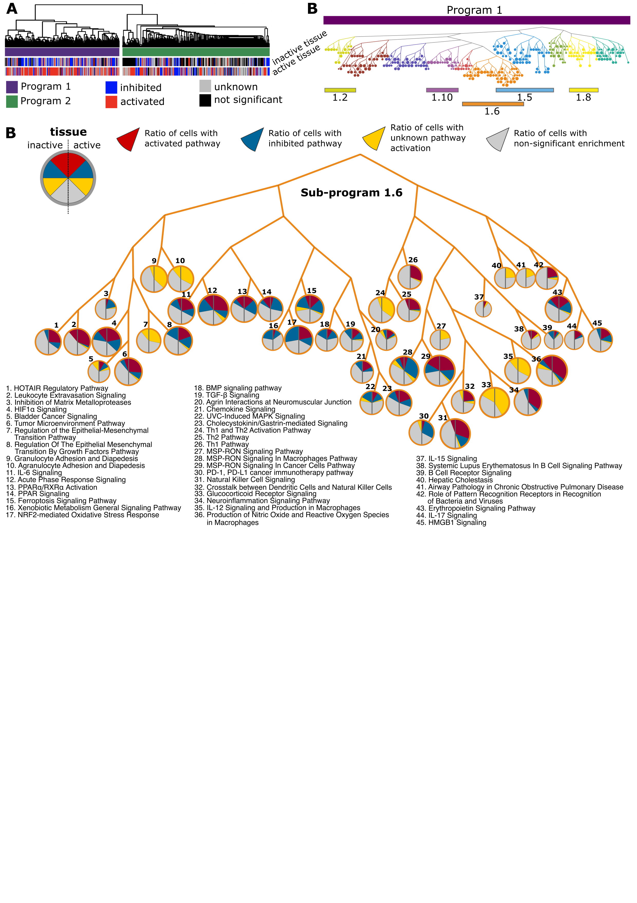

```{r setup, include=FALSE}
knitr::opts_chunk$set(echo = TRUE, eval = FALSE)
```

# Meta analysis of 11 IMIDs for Connective pathway analysis and UR prioritization


## Process the IPA output (MATLAB code)

**Input requirements**

The enriched pathways produced by IPA including the genes that belong to these pathways

**We will produce**

The Jaccard Index between the pathways 

``` matlab:code
%% Define the main path
InputOutputFiles = '../data/CPA_InputFiles/';

%% Main analyses
% define variables:
savename = 'IMID';
PATHH1 = sprintf('%sPathwayenrichment_results/IMIDs/',InputOutputFiles);
FN = readtable(sprintf('%s/PathFilesDescription_IMIDs.csv',InputOutputFiles));
% read in all pathways, filter significant ones, find all involved genes
% and summarize pathway activation direction:
[AllEnrichedPaths,filesForOverlap] = ReadInIPAPathwayEnrichments(FN,PATHH1);
% calculate jaccard index:
Jaccard = CalculateJaccardIndex(AllEnrichedPaths);

%% Save the outputs:
writetable(Jaccard,sprintf('%sJaccardIndex_%s.csv',InputOutputFiles,savename))
writetable(AllEnrichedPaths,sprintf('%sPathInfo_%s.csv',InputOutputFiles,savename))
writetable(FN,sprintf('%sDatasetInfo_%s.csv',InputOutputFiles,savename),'delimiter','\t')
writetable(filesForOverlap,sprintf('%sDieasesPathways_%s.csv',InputOutputFiles,savename),'delimiter','\t')
```


## Connective pathway analysis (R code)

Similarly as described for the [CIA analysis - Connective Pathway Analysis](./CIA-analyses.md), we have performed connective pathway analysis for the IMID datasets.

```{r, message=FALSE}
source("../R/CPA_UR_rankings_functions.R")

MainPath = "data/CPA_InputFiles/"

# load pre-computed Jaccard index matrix and pathway information plus define name which is to be used to save results:

xx = as.matrix(read.csv(paste(MainPath, 'JaccardIndex_IMID.csv',sep='')))
pathinfo = read.table(paste(MainPath,'PathInfo_IMID.csv',sep=''),sep=',',header=1) 
SAVENAME = 'IMID'

pathinfo = runCPA(xx,pathinfo,SAVENAME,1.78)
# save results to file:
write.table(file=paste(MainPath,'CPA_',SAVENAME,'_all_pathways.txt',sep=''),pathinfo,sep="\t", col.names=T, row.names=F, quote=F)

# count the ratios of pathways showing same and opposing activation pattern in inflamed vs non-inflamed organ:
ratios = count.same.and.opposing.activations(pathinfo)
```



## Overlap of the CPA of IMIDs vs individual IMIDs (R code)

In order to get a better overview on which programs and sub-programs of CPA are enriched in individual diseases, we calulated a Fisher Exact Test.
To test if the programs (IMID_P1 and IMID_P2) derived from all analyzed IMIDs overlapped with programs from individual IMIDs in inflamed and non-inflamed organ sites, separately, we performed Fisher’s exact tests (right tailed), using all pathways in connective pathway analysis as a background, followed by correction for multiple testing using the Benjamini-Hochberg procedure. These analyses were repeated for IMID_subprograms (IMID_SPs) and subprograms from individual IMIDs. Disease pathways were defined as all pathways significantly enriched in a particular disease and inflammation state (IPA, p < 0.05). In case two or more datasets were representative of the same disease and condition (for example UC inflamed organs), pathway enrichment p values were combined with Fisher’s method. Enriched pathways were considered those whose combined p < 0.05

```{r, message=FALSE}
# prepare files to check overlap between programs and enriched pathways per IMID:
Dis.Pval = read.table(paste(MainPath,'DieasesPathways_IMID.csv',sep=''),sep='\t',quote = "",header=T)
OverlapingPaths = FindOverlapingPaths(Dis.Pval,pathinfo)

source("../R/plot_overlap.R")
overlap = read.csv('../data/IMIDs_pathway_overlap_with_SPs_reshaped_for_dot_plotALL.txt')

temp_plot <- plot_overlap(overlap)
temp_plot

```

```{r echo=FALSE, eval = TRUE}
library(ggplot2)

source("../R/plot_overlap.R")
overlap = read.csv('../data/IMIDs_pathway_overlap_with_SPs_reshaped_for_dot_plotALL.txt')

temp_plot <- plot_overlap(overlap)
temp_plot
```

## UR enrichment analysis of IMIDs (MATLAB code)
 
**Input requirements**

   -  The metadata table that summarizes the datasets and where the files for each dataset are stored 
   -  Gene information 
   -  The results from connective pathway analysis 

**We will produce**

A table with combined, FDR corrected pvalues and the count of significant p values across all cell types for each program/subprogram and UR 


```matlab:Code

%% INPUT
% DEGs
path_metadata = '../data/Connective_pathway_analysis/AllDatasets_DEGs_martin.mat';
path_gene_info = '../data/Connective_pathway_analysis/gene_info_type_of_gene_2020_03_03.mat';
% connective pathway analysis
path_cpa_program2 = '../data/Connective_pathway_analysis/TreeStructure_nodes2_CLUSTER2_AID_noblood.txt';
path_cpa_program1 = '../data/Connective_pathway_analysis/TreeStructure_nodes2_AID_noblood.txt';

%% OUTPUT_path
path_output = '../data/UR_analysis/UR_predictions_IMIDs_disease_Pvals.xlsx';

%%Load the metadata table
load(path_metadata,'AllDatasets')

%% Load IMID_Ps and IMID_SPs from connective pathway analysis
load(path_gene_info)
gene_info = unique(gene_info(:,{'GeneID','Symbol','Synonyms','type_of_gene'}));
[Fn, AllDatasets] = preprocess(gene_info, AllDatasets);

%% load SPs %% add subprograms of program 1
SP = load_SPs(path_cpa_program1, path_cpa_program2)

%% Load URs: 
UR = load_URs(AllDatasets);
clearvars -except SP Fn savename UR path_output

%% Fisher test enrichment of UR DS in SPs:
FishertestR = Fishers_test(SP,UR,Fn)

%% Combine pvalues over joint and muscle:
CombinedOverInfandNoninf = Fishers_method(FishertestR)

%% For each program and UR, do FDR correction 
CombinedOverInfandNoninf = FDR_correction(CombinedOverInfandNoninf)

%% For each program and UR, count how in how many cell types was UR significant 
[count_Inf, count_Noninf] = count_significant(FishertestR);
CombinedOverInfandNoninf.count_Inf = count_Inf;
CombinedOverInfandNoninf.count_Noninf = count_Noninf;

%% Combine pvals for each disease
CombinedPval_Disease = combine_Pvals(FishertestR);

%% Format output
CombinedPval  = format_output(CombinedOverInfandNoninf,CombinedPval_Disease)

%% Save the data
writetable(CombinedPval,path_output)
head(CombinedPval, 5)

```


| |SP|UR|CombinedP_Inflamed|CombinedP_Noninflamed|CombinedP_All|FDR_Inflamed|FDR_Noninflamed|FDR_All|count_Inflamed|count_Noninflamed|AD_active|AD_inactive|CD_active|CD_inactive|JM_active|JM_inactive|PSO_active|PSO_inactive|RA_active|SS_active|SSc_active|UC_active|UC_inactive|at_risk_T1D_inactive|lupus_active|
|:--:|:--:|:--:|:--:|:--:|:--:|:--:|:--:|:--:|:--:|:--:|:--:|:--:|:--:|:--:|:--:|:--:|:--:|:--:|:--:|:--:|:--:|:--:|:--:|:--:|:--:|
|1|'1.1'|'ACKR1'|9.9633e-01|1.0000e+00|1.0000e+00|1.0000e+00|1.0000e+00|1.0000e+00|0|0|1.0000e+00|1|1.8783e-01|1.0000e+00|1|1|3.7841e-01|1|1.0000e+00|1.0000e+00|1.2591e-01|6.7796e-01|1.0000e+00|1|1.0000e+00|
|2|'1.10'|'ACKR1'|3.9770e-03|1.0000e+00|1.5458e-01|1.2736e-02|1.0000e+00|4.5213e-01|7|0|1.0000e+00|1|2.1877e-04|1.0000e+00|1|1|4.5754e-04|1|1.0000e+00|1.0000e+00|6.1443e-04|1.0047e-01|1.0000e+00|1|1.0000e+00|
|3|'1.2'|'ACKR1'|3.5817e-01|1.0000e+00|9.1909e-01|1.0000e+00|1.0000e+00|1.0000e+00|1|0|1.0000e+00|1|3.0478e-02|1.0000e+00|1|1|5.5395e-04|1|1.0000e+00|1.0000e+00|2.6368e-02|4.3447e-01|1.0000e+00|1|1.0000e+00|
|4|'1.3'|'ACKR1'|1.0000e+00|1.0000e+00|1.0000e+00|1.0000e+00|1.0000e+00|1.0000e+00|0|0|1.0000e+00|1|1.0000e+00|1.0000e+00|1|1|1.0000e+00|1|1.0000e+00|1.0000e+00|1.0000e+00|1.0000e+00|1.0000e+00|1|1.0000e+00|
|5|'1.4'|'ACKR1'|9.9971e-01|1.0000e+00|1.0000e+00|1.0000e+00|1.0000e+00|1.0000e+00|0|0|1.0000e+00|1|3.2724e-01|1.0000e+00|1|1|4.5066e-01|1|1.0000e+00|1.0000e+00|2.0132e-01|7.8095e-01|1.0000e+00|1|1.0000e+00|

  

## logFC and z-score analyses (Python code)

```{python eval = TRUE, include=FALSE}
def set_up_structure_for_output_files():
    datasets = pd.read_table('../data/UR_analysis/file_names.txt', header = None)
    URs = pd.read_table('../data/UR_analysis/URs.txt', header = None)[0]
    activity = pd.read_table('../data/UR_analysis/activity.txt', header = None)
    Datasets_Inf = pd.read_table('../data/UR_analysis/Datasets_Inf.txt', sep = ',', header = None)
    Datasets_Noninf = pd.read_table('../data/UR_analysis/Datasets_Noninf.txt', sep = ',', header = None)
    
    activity.loc[21] = 'duplicate'
    Datasets_Inf.index = URs
    Datasets_Inf.columns = np.array(datasets)[activity == 'yes']
    Datasets_Noninf.index = URs
    Datasets_Noninf.columns = np.array(datasets)[activity == 'no']
    return Datasets_Inf, Datasets_Noninf
  
def preprocess_the_input(URs_all_diseases):
    # Subset to only P1 and only those URs that are significant in at least 1 disease
    URs_all_diseases = URs_all_diseases[URs_all_diseases['SP'] == '1.6']
    IMID_count = list()
    for i in range(len(URs_all_diseases)):
        IMID_count.append(sum(URs_all_diseases.iloc[i,8:] < 0.05))
    URs_all_diseases = URs_all_diseases[np.array(IMID_count) > 0]

    URs_all_diseases = URs_all_diseases.sort_values(by = 'UC_active')
    return URs_all_diseases
  
def logFC_analysis(Datasets_Inf, Datasets_Noninf, path_DEGs):
    ## logFC_analysis
    translation = pd.read_table('../data/UR_analysis/gene_info.txt', sep = ',')
    URs = pd.read_table('../data/UR_analysis/URs.txt', header = None)[0]
    i = 0
    logFC_list = list()
    for dataset in Datasets_Inf.columns:
        data = pd.read_table(path_DEGs + dataset)
        if i in (6,12,15,16):
            if i == 15:
                data = data.rename(columns = {'ORF': 'ENTREZ_GENE_ID'})
            trans = translation[translation['Symbol'].isin(URs)][['GeneID','Symbol']]
            data = trans.merge(data, left_on = 'GeneID', right_on ='ENTREZ_GENE_ID')[['Symbol', 'logFC']]
            data = data.rename(columns = {'Symbol': 'Gene.symbol'})
        else:
            if i in (7,20):
                data = data.rename(columns = {'ORF': 'Gene.symbol'})
            if i == 8:
                data = data.rename(columns = {'Gene.Symbol': 'Gene.symbol'})
            if i == 9:
                data = data.rename(columns = {'GENE_SYMBOL': 'Gene.symbol'})
            if i == 13:
                data = data.rename(columns = {'ID': 'Gene.symbol'})
            data = data[data['adj.P.Val'] < 0.05]
            data = data[data['Gene.symbol'].isin(URs)].drop_duplicates('Gene.symbol')[['Gene.symbol', 'logFC']]

        data = data.rename(columns = {'logFC': dataset})
        data.index = data['Gene.symbol']
        data.pop('Gene.symbol')    
        logFC_list.append(data)
        i = i+1

    logFC_Inf = pd.concat(logFC_list, axis = 1)

    i = 0
    logFC_list = list()
    for dataset in Datasets_Noninf.columns:

        data = pd.read_table(path_DEGs + dataset)
        if i == 3:
            data = data.rename(columns = {'ORF': 'Gene.symbol'})
        if i == 8:
            data = data.rename(columns = {'GENE_NAME': 'Gene.symbol'})
        data = data[data['adj.P.Val'] < 0.05]
        data = data[data['Gene.symbol'].isin(URs)].drop_duplicates('Gene.symbol')[['Gene.symbol', 'logFC']]
        data = data.rename(columns = {'logFC': dataset})
        data.index = data['Gene.symbol']
        data.pop('Gene.symbol')
        logFC_list.append(data)
        i = i+1   
    logFC_Noninf = pd.concat(logFC_list, axis = 1)


    Datasets_Noninf_logFC = Datasets_Noninf.copy()
    Datasets_Inf_logFC = Datasets_Inf.copy()

    i = 0
    for dataset in Datasets_Noninf_logFC.columns:
        Datasets_Noninf_logFC.loc[Datasets_Noninf_logFC[dataset]>0,dataset] =\
        logFC_Noninf[Datasets_Noninf_logFC[dataset]>0][dataset]

    for dataset in Datasets_Inf_logFC.columns:
        if i != 12:
            Datasets_Inf_logFC.loc[Datasets_Inf_logFC[dataset]>0,dataset] =\
            logFC_Inf[Datasets_Inf_logFC[dataset]>0][dataset]
        i = i+1


    summary_logFC = pd.concat((Datasets_Inf_logFC, Datasets_Noninf_logFC), axis = 1)
    summary_logFC = summary_logFC.fillna(0)
    summary_logFC = summary_logFC[summary_logFC.sum(axis = 1) != 0]
    summary_logFC = summary_logFC.loc[summary_logFC.index.isin(['AR', 'ESR2', 'FAS', 'IFNG', 'IL1A', 'IL1B', 'TLR3', 'TNF'])]

    return summary_logFC
  
def zScore_analysis(Datasets_Inf, Datasets_Noninf, path_z_scores):
    ## z score analysis
    z_scores_Inf = list()
    i = 0
    for dataset in Datasets_Inf.columns:
        if i != 12:
            a = pd.read_table(path_z_scores + dataset, sep = ',', index_col = 0)    
            a.columns = [dataset]
            z_scores_Inf.append(a)
        i = i+1
    z_scores_Inf = pd.concat(z_scores_Inf, axis = 1)


    z_scores_Noninf = list()
    for dataset in Datasets_Noninf.columns:
        a = pd.read_table(path_z_scores + dataset, sep = ',', index_col = 0)    
        a.columns = [dataset]
        z_scores_Noninf.append(a)
    z_scores_Noninf = pd.concat(z_scores_Noninf, axis = 1)


    Datasets_Noninf_z_score = Datasets_Noninf.copy()
    Datasets_Inf_z_score = Datasets_Inf.copy()
    i = 0
    for dataset in Datasets_Noninf_z_score.columns:
        Datasets_Noninf_z_score.loc[Datasets_Noninf_z_score[dataset]>0,dataset] =\
        z_scores_Noninf[Datasets_Noninf_z_score[dataset]>0][dataset]

    for dataset in Datasets_Inf_z_score.columns:
        if i != 12:
            Datasets_Inf_z_score.loc[Datasets_Inf_z_score[dataset]>0,dataset] =\
            z_scores_Inf[Datasets_Inf_z_score[dataset]>0][dataset]
        i = i+1

    summary_zScores = pd.concat((Datasets_Inf_z_score, Datasets_Noninf_z_score), axis = 1)
    summary_zScores = summary_zScores.fillna(0)
    summary_zScores = summary_zScores[summary_zScores.sum(axis = 1) != 0]
    summary_zScores = summary_zScores.loc[summary_zScores.index.isin(['AR', 'ESR2', 'FAS', 'IFNG', 'IL1A', 'IL1B', 'TLR3', 'TNF'])]
    
    return summary_zScores
```


**Input requirements**

   -  The UR enrichment scores computed above 
   -  Folder including differentially expressed genes for each dataset
   -  Folder including z scores for each IPA result

**We will produce**

Dot plots showing the A) predicted activities and B) fold changes, of the shared URs of IMID_SP1.6. (Figure S8)

```{python echo=T, results='hide'}
## Input
URs_all_diseases = pd.read_table('../data/UR_analysis/UR_predictions_IMIDs_disease_Pvals.txt', sep = ',')
path_DEGs = '../data/AllDEGfilesMovedToOneFolder/'
path_z_scores = '../data/UR_analysis/z_scores/ '

## Output paths
path_Data_S15 = '../data/UR_analysis/Data S15.xlsx'
path_URs_logFC = '../data/UR_analysis/UR_IMID_summary_logFC.csv'
path_URs_zScore = '../data/UR_analysis/UR_IMID_summary_z.csv'

## Preprocess the data
URs_all_diseases = preprocess_the_input(URs_all_diseases)
Datasets_Inf, Datasets_Noninf = set_up_structure_for_output_files()

## logFC_analysis
summary_logFC = logFC_analysis(Datasets_Inf, Datasets_Noninf, path_DEGs)
summary_logFC.to_csv(path_URs_logFC)

## z score analysis
summary_zScores = zScore_analysis(Datasets_Inf, Datasets_Noninf, path_z_scores)
summary_zScores.to_csv(path_URs_zScores)
```


##Plot the logFC and z_scores of URs (R code)

**URs z score**
```{r echo=TRUE, eval = TRUE}
source('../R/plot_zScore.R')
URs_zScore = read.csv('../data/UR_analysis/UR_IMID_summary_z.csv')
temp_plot <- plot_zScore(URs_zScore)
temp_plot
```

**URs logFC**

```{R echo=TRUE, eval = TRUE}
source("../R/plot_logFC.R")
URs_logFC = read.csv('../data/UR_analysis/UR_IMID_summary_logFC.csv')
temp_plot <- plot_logFC(URs_logFC)
temp_plot
```


