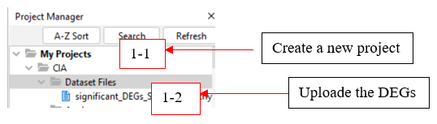
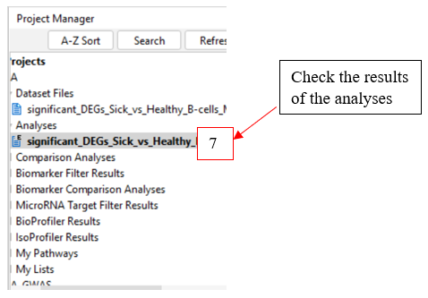

```{r setup, include=FALSE}
knitr::opts_chunk$set(echo = TRUE)
```

## Ingenuity pathway analysis

IPA is a commercial software, but you can request a free trial here
(<https://digitalinsights.qiagen.com/products-overview/discovery-insights-portfolio/analysis-and-visualization/qiagen-ipa/>).

To reproduce the analyses for generation of curation file, pathway analysis, and prediction of upstream regulators (URs) from our project ([CIA analysis](CIA-analyses.html) and [IMIDs analysis](IMIDs-analyses.html)), follow this pipeline.

1. Create a project (eg. CIA) in the Project Manager to upload the lists of genes. Choose the list of genes of interest, dependent on which part of the analysis. For generation of curation-file for prediction of inter-organ interactions, include the genes predicted as URs by the NicheNet analysis, or all genes from the main data input. For pathway analysis or UR prediction, include the DEGs (differentially expressed genes) of interest.
*Note that IPA has a limitation to 5000 genes in the input-file. If \>5000 significant DEGs has been identified, they need to be prioritized. In this study, we never reached \>5000 significant DEGs, so no prioritization was required.* 

{width=45%}

2. Upload the genes of interest into the project “Dataset Files”. For pathway and UR prediction, include the DEGs corresponding LogFCs (and q-values if available). Based on these data, choose the ID "Mouse gene symbol" or “Human gene symbol”, and the observation names “Expr Log Ratio” (LogFC) and “Expr False Discovery Rate” (q-val). Keep both LogFC and q-val as the same group, “observation 1”. ”Save” and name the dataset.

{width=65%}


### Generate curation file

3. In the top tab tools, the “Location” of the molecules/genes is specified. The results can be downloaded by clicking 
{width=4%}
. The location of the molecules/genes were in our study confirmed using the [Human Protein Atlas](https://www.proteinatlas.org/).  

{width=65%}

For downstream codes to run smoothly, save the output file to "../data/IPA/curation/curation_file.txt".

### Pathway analysis and prediction of URs

**For each list of DEGs, perform step 3 - 9, for pathway analysis and prediction of URs in IPA.**

3. In the lower right corner, click “Analyze/Filter Dataset” and then “Core Analysis” to perform IPA analysis of the data.
    
{width=65%}

4. Click ”next”, to get to the settings.
    
{width=45%}

5. In the settings. based on this dataset, define “General settings - Species” = Mouse or Human, “Node Types” = All, “Data Sources” = All, “Tissues&Cell Lines” = All, and “Mutation” = All.

6. Run the analyses by “Run Analysis”.
    
{width=65%}

7. All the performed analyses can be found in the “CIA” project under “Analyses”. To see and export the results for further analyses, choose your current analysis.
    
{width=40%}

8. In the top tab tools, go to “Upstream Analysis” to show the UR prediction results. The results can be downloaded by clicking
{width=4%}
.

{width=65%}

For downstream codes to run smoothly, save the output files in "../data/IPA/pathway_analysis/", named according to following pattern **???**.

9. Next, go to “Upstream Analysis”, in the top tab tools, to show the UR prediction results. The results can be downloaded by clicking
{width=4%}
.
    
{width=65%}

For downstream codes to run smoothly, save the output files in "../data/IPA/pathway_analysis/", named according to following pattern **???**.

**Add example output table from IPA, and potential code to make readable by R**
